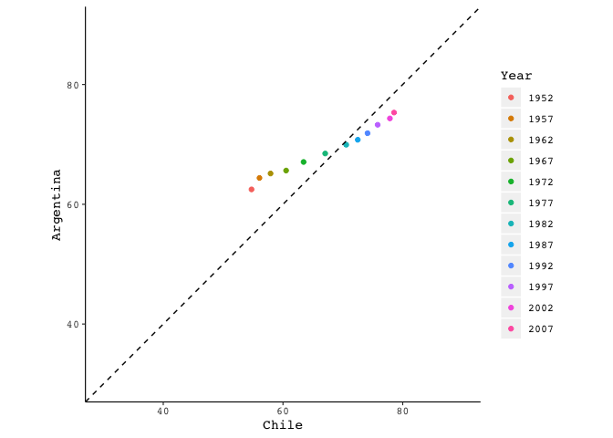
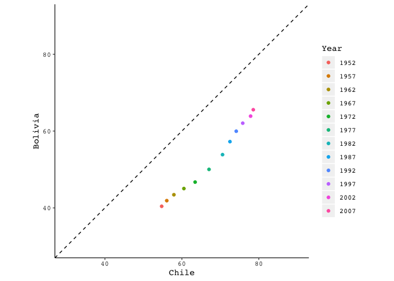
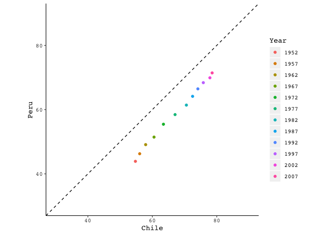
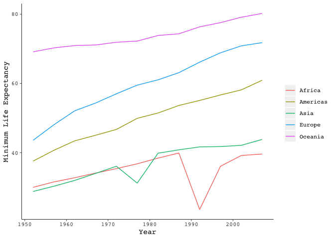

Homework4
================

As usual, the first task is to load the packages.

``` r
library(gapminder)
library(tidyverse)
```

    ## ── Attaching packages ────────────────────────────── tidyverse 1.2.1 ──

    ## ✔ ggplot2 3.0.0     ✔ purrr   0.2.5
    ## ✔ tibble  1.4.2     ✔ dplyr   0.7.6
    ## ✔ tidyr   0.8.1     ✔ stringr 1.3.1
    ## ✔ readr   1.1.1     ✔ forcats 0.3.0

    ## ── Conflicts ───────────────────────────────── tidyverse_conflicts() ──
    ## ✖ dplyr::filter() masks stats::filter()
    ## ✖ dplyr::lag()    masks stats::lag()

``` r
library(dplyr)
library(igraph)
```

    ## 
    ## Attaching package: 'igraph'

    ## The following objects are masked from 'package:dplyr':
    ## 
    ##     as_data_frame, groups, union

    ## The following objects are masked from 'package:purrr':
    ## 
    ##     compose, simplify

    ## The following object is masked from 'package:tidyr':
    ## 
    ##     crossing

    ## The following object is masked from 'package:tibble':
    ## 
    ##     as_data_frame

    ## The following objects are masked from 'package:stats':
    ## 
    ##     decompose, spectrum

    ## The following object is masked from 'package:base':
    ## 
    ##     union

Activity \#2 - Exploring Chile's neighbours
===========================================

Task: "*Make a tibble with one row per year and columns for life expectancy for two or more countries. Use `knitr::kable()` to make this table look pretty in your rendered homework. Take advantage of this new data shape to scatterplot life expectancy for one country against that of another."*

``` r
ChileAndFriends <- gapminder %>%
  filter(country %in% c("Chile","Argentina", "Peru", "Bolivia")) %>%
  select(year, country, lifeExp) %>%
  spread(country,lifeExp) %>%
  rename(Year = year)
knitr::kable(ChileAndFriends)
```

|  Year|  Argentina|  Bolivia|   Chile|    Peru|
|-----:|----------:|--------:|-------:|-------:|
|  1952|     62.485|   40.414|  54.745|  43.902|
|  1957|     64.399|   41.890|  56.074|  46.263|
|  1962|     65.142|   43.428|  57.924|  49.096|
|  1967|     65.634|   45.032|  60.523|  51.445|
|  1972|     67.065|   46.714|  63.441|  55.448|
|  1977|     68.481|   50.023|  67.052|  58.447|
|  1982|     69.942|   53.859|  70.565|  61.406|
|  1987|     70.774|   57.251|  72.492|  64.134|
|  1992|     71.868|   59.957|  74.126|  66.458|
|  1997|     73.275|   62.050|  75.816|  68.386|
|  2002|     74.340|   63.883|  77.860|  69.906|
|  2007|     75.320|   65.554|  78.553|  71.421|

After carefully crafting the code of a single plot, the script can be copied and edited with the corresponding country. This yields three comparative plots of Chile versus its neighbours.

``` r
ChilevArgentina <- ChileAndFriends %>%
  ggplot(aes(Chile, Argentina, color=factor(Year))) +
  geom_point() +
  xlim(30,90) +
  ylim(30,90) +
  coord_fixed() +
  geom_abline(intercept = 0, linetype="dashed", slope = 1) +
    theme(plot.subtitle = element_text(vjust = 1), 
    plot.caption = element_text(vjust = 1), 
    axis.line = element_line(size = 0.4, 
    linetype = "solid"), axis.ticks = element_line(size = 0.4), 
    axis.title = element_text(family = "mono"), 
    axis.text = element_text(family = "mono"), 
    axis.text.x = element_text(family = "mono"), 
    axis.text.y = element_text(family = "mono"), 
    plot.title = element_text(family = "mono"),
    panel.background = element_rect(fill = NA)) +
    labs(colour = "Year") +
    theme(legend.text = element_text(family = "mono"), 
    legend.title = element_text(family = "mono"))

ChilevBolivia <- ChileAndFriends %>%
  ggplot(aes(Chile, Bolivia, color=factor(Year))) +
  geom_point() +
  xlim(30,90) +
  ylim(30,90) +
  coord_fixed() +
  geom_abline(intercept = 0, linetype="dashed", slope = 1) +
    theme(plot.subtitle = element_text(vjust = 1), 
    plot.caption = element_text(vjust = 1), 
    axis.line = element_line(size = 0.4, 
    linetype = "solid"), axis.ticks = element_line(size = 0.4), 
    axis.title = element_text(family = "mono"), 
    axis.text = element_text(family = "mono"), 
    axis.text.x = element_text(family = "mono"), 
    axis.text.y = element_text(family = "mono"), 
    plot.title = element_text(family = "mono"),
    panel.background = element_rect(fill = NA)) +
    labs(colour = "Year") +
    theme(legend.text = element_text(family = "mono"), 
    legend.title = element_text(family = "mono"))

ChilevPeru <- ChileAndFriends %>%
  ggplot(aes(Chile, Peru, color=factor(Year))) +
  geom_point() +
  xlim(30,90) +
  ylim(30,90) +
  coord_fixed() +
  geom_abline(intercept = 0, linetype="dashed", slope = 1) +
    theme(plot.subtitle = element_text(vjust = 1), 
    plot.caption = element_text(vjust = 1), 
    axis.line = element_line(size = 0.4, 
    linetype = "solid"), axis.ticks = element_line(size = 0.4), 
    axis.title = element_text(family = "mono"), 
    axis.text = element_text(family = "mono"), 
    axis.text.x = element_text(family = "mono"), 
    axis.text.y = element_text(family = "mono"), 
    plot.title = element_text(family = "mono"),
    panel.background = element_rect(fill = NA)) +
    labs(colour = "Year") +
    theme(legend.text = element_text(family = "mono"), 
    legend.title = element_text(family = "mono"))
```

For Chile and Argentina

``` r
ChilevArgentina
```



For Chile and Bolivia

``` r
ChilevBolivia
```



For Chile and Peru

``` r
ChilevPeru
```



Activity \#3 - Long and wide format `lifeExp`
=============================================

Task: *"Compute some measure of life expectancy (mean? median? **min?** max?) for all possible combinations of continent and year. Reshape that to have one row per year and one variable for each continent. Or the other way around: one row per continent and one variable per year. Use `knitr::kable()` to make these tables look pretty in your rendered homework.Is there a plot that is easier to make with the data in this shape versis the usual form?"*

I wonder how the *minimum* value of life expectancy has changed over the years. This is often overlooked, granted that it is the maximum life expectancy that gets the spotlight. First, lets look at the "tidy-format" version of this data, where each row is a single measurement. For extra tidyness, the default names of 'year' and 'continent' are renamed to be capitalized from now onwards.

``` r
lifeExpMin <- gapminder %>%
  group_by(continent, year) %>%
  summarize("Minimum Life Expectancy" = min(lifeExp)) %>%
  rename(Continent = continent, Year = year)
knitr::kable(lifeExpMin)
```

| Continent |  Year|  Minimum Life Expectancy|
|:----------|-----:|------------------------:|
| Africa    |  1952|                   30.000|
| Africa    |  1957|                   31.570|
| Africa    |  1962|                   32.767|
| Africa    |  1967|                   34.113|
| Africa    |  1972|                   35.400|
| Africa    |  1977|                   36.788|
| Africa    |  1982|                   38.445|
| Africa    |  1987|                   39.906|
| Africa    |  1992|                   23.599|
| Africa    |  1997|                   36.087|
| Africa    |  2002|                   39.193|
| Africa    |  2007|                   39.613|
| Americas  |  1952|                   37.579|
| Americas  |  1957|                   40.696|
| Americas  |  1962|                   43.428|
| Americas  |  1967|                   45.032|
| Americas  |  1972|                   46.714|
| Americas  |  1977|                   49.923|
| Americas  |  1982|                   51.461|
| Americas  |  1987|                   53.636|
| Americas  |  1992|                   55.089|
| Americas  |  1997|                   56.671|
| Americas  |  2002|                   58.137|
| Americas  |  2007|                   60.916|
| Asia      |  1952|                   28.801|
| Asia      |  1957|                   30.332|
| Asia      |  1962|                   31.997|
| Asia      |  1967|                   34.020|
| Asia      |  1972|                   36.088|
| Asia      |  1977|                   31.220|
| Asia      |  1982|                   39.854|
| Asia      |  1987|                   40.822|
| Asia      |  1992|                   41.674|
| Asia      |  1997|                   41.763|
| Asia      |  2002|                   42.129|
| Asia      |  2007|                   43.828|
| Europe    |  1952|                   43.585|
| Europe    |  1957|                   48.079|
| Europe    |  1962|                   52.098|
| Europe    |  1967|                   54.336|
| Europe    |  1972|                   57.005|
| Europe    |  1977|                   59.507|
| Europe    |  1982|                   61.036|
| Europe    |  1987|                   63.108|
| Europe    |  1992|                   66.146|
| Europe    |  1997|                   68.835|
| Europe    |  2002|                   70.845|
| Europe    |  2007|                   71.777|
| Oceania   |  1952|                   69.120|
| Oceania   |  1957|                   70.260|
| Oceania   |  1962|                   70.930|
| Oceania   |  1967|                   71.100|
| Oceania   |  1972|                   71.890|
| Oceania   |  1977|                   72.220|
| Oceania   |  1982|                   73.840|
| Oceania   |  1987|                   74.320|
| Oceania   |  1992|                   76.330|
| Oceania   |  1997|                   77.550|
| Oceania   |  2002|                   79.110|
| Oceania   |  2007|                   80.204|

The years in *Gapminder* range from 1952 to 2007 in intervals of 5 years, which means that per continent there are 12 unique year measurements. This can be represented in a "wide-format" table that shows the minimum `lifeExp` per continent over years. Wide-format is also known as "human eye" ready, because its compact and easy to read.

``` r
YearSort <- lifeExpMin %>%
  spread(key = Continent, value= "Minimum Life Expectancy")
knitr::kable(YearSort)
```

|  Year|  Africa|  Americas|    Asia|  Europe|  Oceania|
|-----:|-------:|---------:|-------:|-------:|--------:|
|  1952|  30.000|    37.579|  28.801|  43.585|   69.120|
|  1957|  31.570|    40.696|  30.332|  48.079|   70.260|
|  1962|  32.767|    43.428|  31.997|  52.098|   70.930|
|  1967|  34.113|    45.032|  34.020|  54.336|   71.100|
|  1972|  35.400|    46.714|  36.088|  57.005|   71.890|
|  1977|  36.788|    49.923|  31.220|  59.507|   72.220|
|  1982|  38.445|    51.461|  39.854|  61.036|   73.840|
|  1987|  39.906|    53.636|  40.822|  63.108|   74.320|
|  1992|  23.599|    55.089|  41.674|  66.146|   76.330|
|  1997|  36.087|    56.671|  41.763|  68.835|   77.550|
|  2002|  39.193|    58.137|  42.129|  70.845|   79.110|
|  2007|  39.613|    60.916|  43.828|  71.777|   80.204|

Conversely, the same data can be shown as the counterpart "wide-format" table, where rows are continets and columns are years. The same code is used, the only change is in the `spread` 'key' variable, from *continent* to *year*. This conversion is useful for organizing data in different spaces - its the same data, but it can fit different spaces, which is useful for presentations and communicating data.

``` r
YearSort <- lifeExpMin %>%
  spread(key = Year, value= "Minimum Life Expectancy")
knitr::kable(YearSort)
```

| Continent |    1952|    1957|    1962|    1967|    1972|    1977|    1982|    1987|    1992|    1997|    2002|    2007|
|:----------|-------:|-------:|-------:|-------:|-------:|-------:|-------:|-------:|-------:|-------:|-------:|-------:|
| Africa    |  30.000|  31.570|  32.767|  34.113|  35.400|  36.788|  38.445|  39.906|  23.599|  36.087|  39.193|  39.613|
| Americas  |  37.579|  40.696|  43.428|  45.032|  46.714|  49.923|  51.461|  53.636|  55.089|  56.671|  58.137|  60.916|
| Asia      |  28.801|  30.332|  31.997|  34.020|  36.088|  31.220|  39.854|  40.822|  41.674|  41.763|  42.129|  43.828|
| Europe    |  43.585|  48.079|  52.098|  54.336|  57.005|  59.507|  61.036|  63.108|  66.146|  68.835|  70.845|  71.777|
| Oceania   |  69.120|  70.260|  70.930|  71.100|  71.890|  72.220|  73.840|  74.320|  76.330|  77.550|  79.110|  80.204|

Minimum life expectancy can be plotted to visually explore trends over time.

``` r
gapminder %>%  group_by(continent, year) %>% summarize(minLife = min(lifeExp)) %>%
  ggplot(aes(y = minLife, x = year, color = continent)) + geom_line() + theme(plot.subtitle = element_text(vjust = 1), 
    plot.caption = element_text(vjust = 1), 
    axis.line = element_line(size = 0.3, 
    linetype = "solid"), axis.ticks = element_line(size = 0.3), 
    axis.title = element_text(family = "mono"), 
    axis.text = element_text(family = "mono"), 
    axis.text.x = element_text(family = "mono"), 
    axis.text.y = element_text(family = "mono"), 
    plot.title = element_text(family = "mono"), 
    legend.text = element_text(family = "mono"), 
    legend.title = element_text(family = "mono"), 
    panel.background = element_rect(fill = NA)) + 
    labs(x = "Year", y = "Minimum Life Expectancy") +
    labs(title = NULL, colour = NULL)
```



This revealed unexpected trends for Asia and Africa. In the early 1990s Africa experienced a strong dip in its minimum life expectancy - maybe linked to the Rwandan genocide.

Join - South American cities
============================

First lets explore the countries within the Americas countries within *Gapminder*, so that the extracted South American country names match those in the data set.

``` r
Americas <- gapminder %>%
   filter(continent %in% c("Americas"), year == 1997)
knitr::kable(Americas)
```

| country             | continent |  year|  lifeExp|        pop|  gdpPercap|
|:--------------------|:----------|-----:|--------:|----------:|----------:|
| Argentina           | Americas  |  1997|   73.275|   36203463|  10967.282|
| Bolivia             | Americas  |  1997|   62.050|    7693188|   3326.143|
| Brazil              | Americas  |  1997|   69.388|  168546719|   7957.981|
| Canada              | Americas  |  1997|   78.610|   30305843|  28954.926|
| Chile               | Americas  |  1997|   75.816|   14599929|  10118.053|
| Colombia            | Americas  |  1997|   70.313|   37657830|   6117.362|
| Costa Rica          | Americas  |  1997|   77.260|    3518107|   6677.045|
| Cuba                | Americas  |  1997|   76.151|   10983007|   5431.990|
| Dominican Republic  | Americas  |  1997|   69.957|    7992357|   3614.101|
| Ecuador             | Americas  |  1997|   72.312|   11911819|   7429.456|
| El Salvador         | Americas  |  1997|   69.535|    5783439|   5154.825|
| Guatemala           | Americas  |  1997|   66.322|    9803875|   4684.314|
| Haiti               | Americas  |  1997|   56.671|    6913545|   1341.727|
| Honduras            | Americas  |  1997|   67.659|    5867957|   3160.455|
| Jamaica             | Americas  |  1997|   72.262|    2531311|   7121.925|
| Mexico              | Americas  |  1997|   73.670|   95895146|   9767.298|
| Nicaragua           | Americas  |  1997|   68.426|    4609572|   2253.023|
| Panama              | Americas  |  1997|   73.738|    2734531|   7113.692|
| Paraguay            | Americas  |  1997|   69.400|    5154123|   4247.400|
| Peru                | Americas  |  1997|   68.386|   24748122|   5838.348|
| Puerto Rico         | Americas  |  1997|   74.917|    3759430|  16999.433|
| Trinidad and Tobago | Americas  |  1997|   69.465|    1138101|   8792.573|
| United States       | Americas  |  1997|   76.810|  272911760|  35767.433|
| Uruguay             | Americas  |  1997|   74.223|    3262838|   9230.241|
| Venezuela           | Americas  |  1997|   72.146|   22374398|  10165.495|

Next, lets list the countries of South America and their respective capital cities.

``` r
country <- c("Argentina", "Bolivia", "Brazil", "Chile", "Colombia", "Ecuador", "Paraguay", "Peru", "Uruguay", "Venezuela")
Capital_City <- c("Buenos Aires", "La Paz", "Brasilia", "Santiago", "Bogota", "Quito", "Asuncion", "Lima", "Montevideo", "Caracas")
SouthAmericanCapitals <- data.frame(country, Capital_City)
knitr::kable(SouthAmericanCapitals)
```

| country   | Capital\_City |
|:----------|:--------------|
| Argentina | Buenos Aires  |
| Bolivia   | La Paz        |
| Brazil    | Brasilia      |
| Chile     | Santiago      |
| Colombia  | Bogota        |
| Ecuador   | Quito         |
| Paraguay  | Asuncion      |
| Peru      | Lima          |
| Uruguay   | Montevideo    |
| Venezuela | Caracas       |

``` r
FullJoin <- full_join(SouthAmericanCapitals, Americas)
```

    ## Joining, by = "country"

    ## Warning: Column `country` joining factors with different levels, coercing
    ## to character vector

``` r
knitr::kable(FullJoin)
```

| country             | Capital\_City | continent |  year|  lifeExp|        pop|  gdpPercap|
|:--------------------|:--------------|:----------|-----:|--------:|----------:|----------:|
| Argentina           | Buenos Aires  | Americas  |  1997|   73.275|   36203463|  10967.282|
| Bolivia             | La Paz        | Americas  |  1997|   62.050|    7693188|   3326.143|
| Brazil              | Brasilia      | Americas  |  1997|   69.388|  168546719|   7957.981|
| Chile               | Santiago      | Americas  |  1997|   75.816|   14599929|  10118.053|
| Colombia            | Bogota        | Americas  |  1997|   70.313|   37657830|   6117.362|
| Ecuador             | Quito         | Americas  |  1997|   72.312|   11911819|   7429.456|
| Paraguay            | Asuncion      | Americas  |  1997|   69.400|    5154123|   4247.400|
| Peru                | Lima          | Americas  |  1997|   68.386|   24748122|   5838.348|
| Uruguay             | Montevideo    | Americas  |  1997|   74.223|    3262838|   9230.241|
| Venezuela           | Caracas       | Americas  |  1997|   72.146|   22374398|  10165.495|
| Canada              | NA            | Americas  |  1997|   78.610|   30305843|  28954.926|
| Costa Rica          | NA            | Americas  |  1997|   77.260|    3518107|   6677.045|
| Cuba                | NA            | Americas  |  1997|   76.151|   10983007|   5431.990|
| Dominican Republic  | NA            | Americas  |  1997|   69.957|    7992357|   3614.101|
| El Salvador         | NA            | Americas  |  1997|   69.535|    5783439|   5154.825|
| Guatemala           | NA            | Americas  |  1997|   66.322|    9803875|   4684.314|
| Haiti               | NA            | Americas  |  1997|   56.671|    6913545|   1341.727|
| Honduras            | NA            | Americas  |  1997|   67.659|    5867957|   3160.455|
| Jamaica             | NA            | Americas  |  1997|   72.262|    2531311|   7121.925|
| Mexico              | NA            | Americas  |  1997|   73.670|   95895146|   9767.298|
| Nicaragua           | NA            | Americas  |  1997|   68.426|    4609572|   2253.023|
| Panama              | NA            | Americas  |  1997|   73.738|    2734531|   7113.692|
| Puerto Rico         | NA            | Americas  |  1997|   74.917|    3759430|  16999.433|
| Trinidad and Tobago | NA            | Americas  |  1997|   69.465|    1138101|   8792.573|
| United States       | NA            | Americas  |  1997|   76.810|  272911760|  35767.433|

``` r
LeftJoin <- left_join(SouthAmericanCapitals, Americas)
```

    ## Joining, by = "country"

    ## Warning: Column `country` joining factors with different levels, coercing
    ## to character vector

``` r
knitr::kable(LeftJoin)
```

| country   | Capital\_City | continent |  year|  lifeExp|        pop|  gdpPercap|
|:----------|:--------------|:----------|-----:|--------:|----------:|----------:|
| Argentina | Buenos Aires  | Americas  |  1997|   73.275|   36203463|  10967.282|
| Bolivia   | La Paz        | Americas  |  1997|   62.050|    7693188|   3326.143|
| Brazil    | Brasilia      | Americas  |  1997|   69.388|  168546719|   7957.981|
| Chile     | Santiago      | Americas  |  1997|   75.816|   14599929|  10118.053|
| Colombia  | Bogota        | Americas  |  1997|   70.313|   37657830|   6117.362|
| Ecuador   | Quito         | Americas  |  1997|   72.312|   11911819|   7429.456|
| Paraguay  | Asuncion      | Americas  |  1997|   69.400|    5154123|   4247.400|
| Peru      | Lima          | Americas  |  1997|   68.386|   24748122|   5838.348|
| Uruguay   | Montevideo    | Americas  |  1997|   74.223|    3262838|   9230.241|
| Venezuela | Caracas       | Americas  |  1997|   72.146|   22374398|  10165.495|

``` r
InnerJoin <- inner_join(SouthAmericanCapitals, Americas)
```

    ## Joining, by = "country"

    ## Warning: Column `country` joining factors with different levels, coercing
    ## to character vector

``` r
knitr::kable(InnerJoin)
```

| country   | Capital\_City | continent |  year|  lifeExp|        pop|  gdpPercap|
|:----------|:--------------|:----------|-----:|--------:|----------:|----------:|
| Argentina | Buenos Aires  | Americas  |  1997|   73.275|   36203463|  10967.282|
| Bolivia   | La Paz        | Americas  |  1997|   62.050|    7693188|   3326.143|
| Brazil    | Brasilia      | Americas  |  1997|   69.388|  168546719|   7957.981|
| Chile     | Santiago      | Americas  |  1997|   75.816|   14599929|  10118.053|
| Colombia  | Bogota        | Americas  |  1997|   70.313|   37657830|   6117.362|
| Ecuador   | Quito         | Americas  |  1997|   72.312|   11911819|   7429.456|
| Paraguay  | Asuncion      | Americas  |  1997|   69.400|    5154123|   4247.400|
| Peru      | Lima          | Americas  |  1997|   68.386|   24748122|   5838.348|
| Uruguay   | Montevideo    | Americas  |  1997|   74.223|    3262838|   9230.241|
| Venezuela | Caracas       | Americas  |  1997|   72.146|   22374398|  10165.495|

``` r
SemiJoin <- semi_join(SouthAmericanCapitals, Americas)
```

    ## Joining, by = "country"

    ## Warning: Column `country` joining factors with different levels, coercing
    ## to character vector

``` r
knitr::kable(SemiJoin)
```

| country   | Capital\_City |
|:----------|:--------------|
| Argentina | Buenos Aires  |
| Bolivia   | La Paz        |
| Brazil    | Brasilia      |
| Chile     | Santiago      |
| Colombia  | Bogota        |
| Ecuador   | Quito         |
| Paraguay  | Asuncion      |
| Peru      | Lima          |
| Uruguay   | Montevideo    |
| Venezuela | Caracas       |

In this case `semi_join` is the only function that yields a completely different table, whereas `full_join` merges all data and includes empty spaces.
